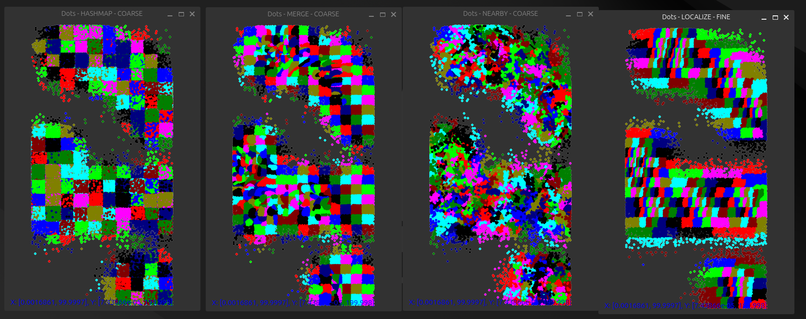

# DFT Partitioner

This tool takes list of instances, x, y and bitsize. Then it generates partitions with each cell below maxBitSize. The best algorithm is the "Optimized" variant which produces localized partitions using grid based lookup. The lookup is O(1) and only the partition creation forces O(N) complexity.

# Motivation

In designs that use DFT (Design For Test) logic, partitioning is often required when using centralized compressor/decompressor architectures. While setup timing is typically not very sensitive for DFT logic, the added nets can significantly increase routing congestion. If the DFT cells are spread too far apart, unnecessary long routing paths are created. Finding the optimal grouping becomes computationally expensive, as evaluating all possible combinations scales roughly as O(N²), where N is the number of cells.

This repository implements four algorithms for DFT partitioning that aim to balance routing quality and runtime efficiency.

Here are results of the benchmarks for 86k cells with 1 up to 8 bits (uniformly distributed) instances:

| Algorithm             | Runtime | Routing (Total Net Length Increase) |
| --------------------  | ------- | ----------------------------------- |
| **Nearby**            | 35 s    | 20k                                 |
| **Hashmap**           | 0.02 s  | 39k                                 |
| **Merge**             | 5.2 s   | 20.5k                               |
| **Optimized**         | 0.1 s   | 19k                                 |

Here are results of the benchmarks for 994k cells with 1 up to 8 bits (uniformly distributed) instances:

| Algorithm             | Runtime | Routing (Total Net Length Increase) |
| --------------------  | ------- | ----------------------------------- |
| **Nearby**            | DNF     | DNF                                 |
| **Hashmap**           | 0.235s  | 405k                                |
| **Merge**             | 58s     | 73k                                 |
| **Optimized**         | 1.079s  | 72k                                 |

## 1️⃣ Vendor (Nearby)

Each cell is merged into its nearest unmerged cell.

Complexity: ~O(N log N), since each cell must search for its nearest neighbor, but the search space shrinks as merges happen.

Notes: Simple heuristic, but can struggle when cells are not uniformly distributed.

This is the algorithm employed by Vendor. It just selects the nearest cell to group to. While this might be counterintiuitve. It does not yield shortest distance as it might group close cells together resulting in lack of "mid point" stops. Without this stops this means that with small partitions the partitions might be starved of instances and have to reach cells that are FAR away to reach bit limit requirements.

## 2️⃣ Vendor (Hashmap)

Inspired by a commercial DFT partitioner vendor number two. O(N) complexity due to using hashmaps with O(N) hashing. Cells with the same hash are merged together.

The commercial tool uses hash maps based on cell names and hierarchy (without location awareness).

This implementation adds location-based hash maps, which improves clustering quality but lacks logic for intelligently connecting groups, potentially leaving distant cells grouped together.

Complexity: Linear hash map operations, but quality depends on initial distribution.

The main advantage of this method is that it produces results very quickly. The runtime of the commercial tool was measured in minutes. The same algorithm was implemented here for one-to-one comparison. Then the location based hashing was used instead. It yielded better results. Original reimplementation cannot be published.

## 3️⃣ Merging

Divides the design into equal regions and moves cells to balance partition sizes.

Complexity: Initial splitting is O(log N), but rebalancing operations can approach O(NlogN) up to O(N^2).

Notes: Balances partition sizes directly but runtime is quite high.

## 4️⃣ Localized

An improved version of Merge that uses a grid-based "binning" approach.

The design is divided into small bins; merging operates at bin-level instead of cell-level, reducing total operations. Then small bins are grouped into vertical windows. Windows size is determined based on the Nx/Ny algorithm.

User Input: Only requires a grid size parameter.

Tradeoff: Smaller grids yield better routing quality but increase runtime; larger grids reduce runtime but may result in worse routing.

Complexity: O(N) in average cases (when bins are naturally balanced), where the bins are not natuarally balanced and have to split the routing length will be degraded.

Notes: If bins are well balanced, only minimal cell movement is needed (usually within one grid unit). Bin balancing depends on selected grid size.

| Algorithm | Grid    | Instances | Runtime (ms) | Route Len |
|-----------|---------|-----------|--------------|-----------|
| HASHMAP  | FINE   | 10000 | 2.28578 | 16075.2 |
| LOCALIZE | FINE   | 10000 | 22.9446 | 6219.53 |
| LOCALIZE | COARSE | 10000 | 6.34681 | 7073.15 |
| MERGING  |  N/A   | 10000 | 502.158 | 6334.94 |
| NEARBY   |  N/A   | 10000 | 370.27 | 6439.52 |
| | | | | |
| HASHMAP  | FINE   | 20000 | 7.39548 | 29997.1 |
| LOCALIZE | FINE   | 20000 | 43.7549 | 12795 |
| LOCALIZE | COARSE | 20000 | 16.9249 | 15588.2 |
| MERGING  |  N/A   | 20000 | 1098.2 | 12858.2 |
| NEARBY   |  N/A   | 20000 | 3485.05 | 13163 |
| | | | | |
| HASHMAP  | FINE   | 40000 | 16.378 | 36930.1 |
| LOCALIZE | FINE   | 40000 | 72.5583 | 19442.8 |
| LOCALIZE | COARSE | 40000 | 40.1824 | 26561.5 |
| MERGING  |  N/A   | 40000 | 2900.7 | 19743.1 |
| NEARBY   |  N/A   | 40000 | 17440.7 | 20064.8 |
| | | | | |

